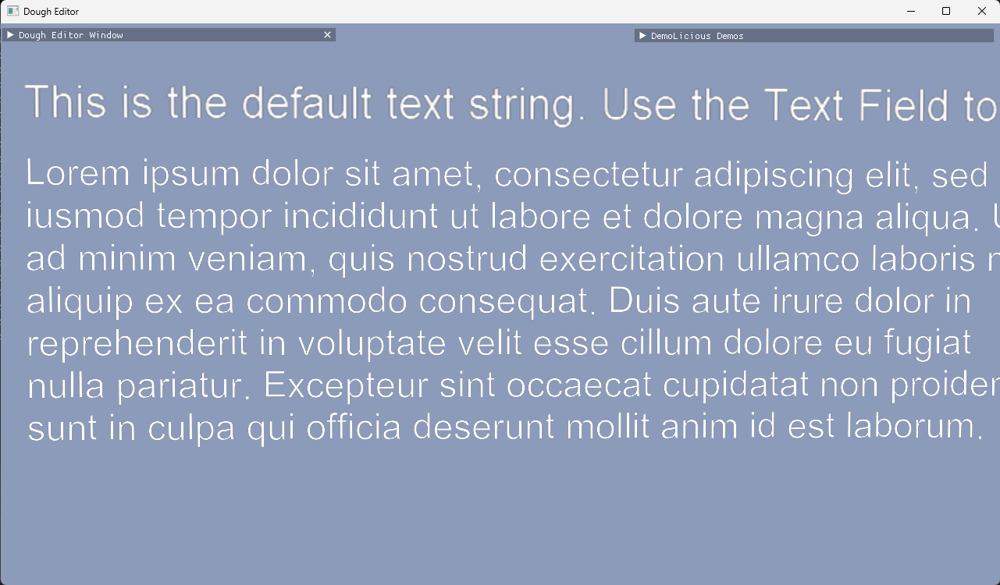
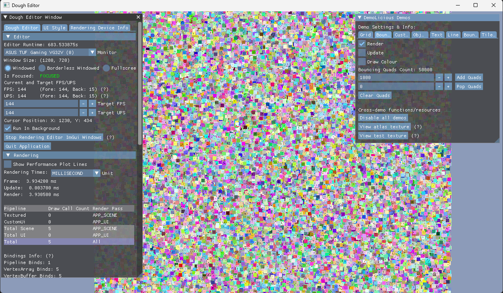

# Dough

A Game engine written in C\+\+ using Vulkan.
Please note: I started this project so I could learn Vulkan, therefore, the code is not recommended for production use and is subject to change.
A small number of features from C\+\+17 are used so that version will be required to compile the project as is.

NOTE:: The .lib file of the external libraries that use .lib (currently Vulkan & GLFW) are included in the repository.
If a different one is required then swapping for a different version is possible as long as it's in the same directory and under the same name.
I hope to include a much nicer automated version check and install script for said libraries later on.

## External Libraries Used:
- [Vulkan](https://www.lunarg.com/vulkan-sdk/)
- [GLFW](https://www.glfw.org/)
- [GLM](https://github.com/g-truc/glm)
- [STB](https://github.com/nothings/stb)
- [ImGui](https://github.com/ocornut/imgui)
- [Tiny OBJ Loader](https://github.com/tinyobjloader)
- [MSDF Font Rendering](https://github.com/Chlumsky/msdfgen) - GLSL code used for shader and atlas generator used to create texture altasses.
- [Tracy Profiler](https://github.com/wolfpld/tracy)
- [Premake](https://premake.github.io/) - Used to build workspace/solution files.

## Preview Images
Here are a few images showing some of the features currently available:

 rendering.")

